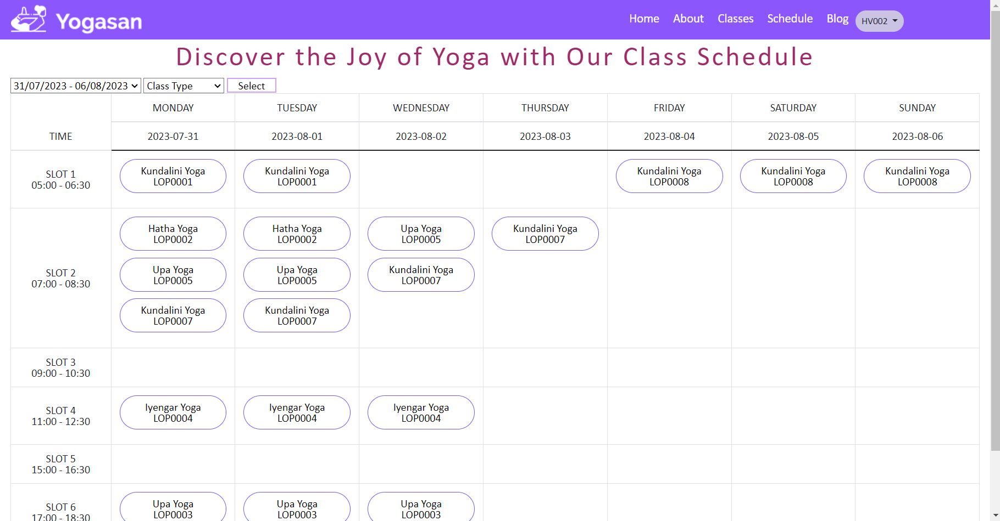
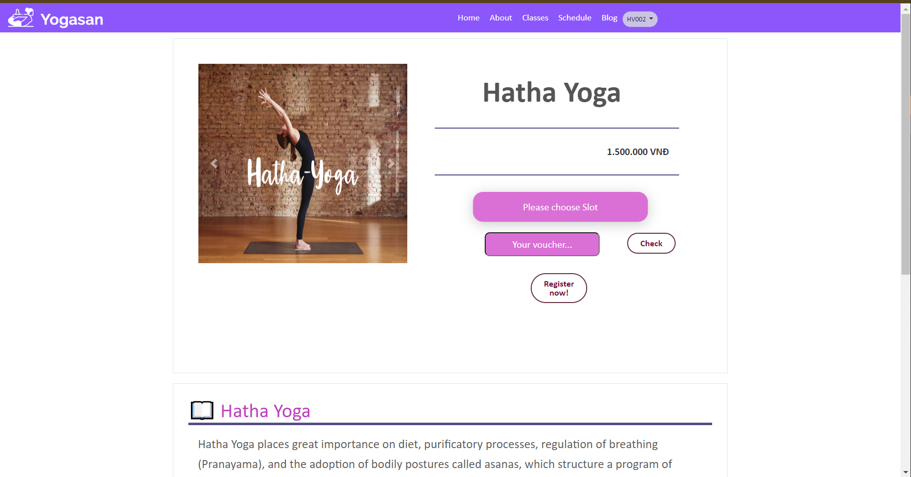
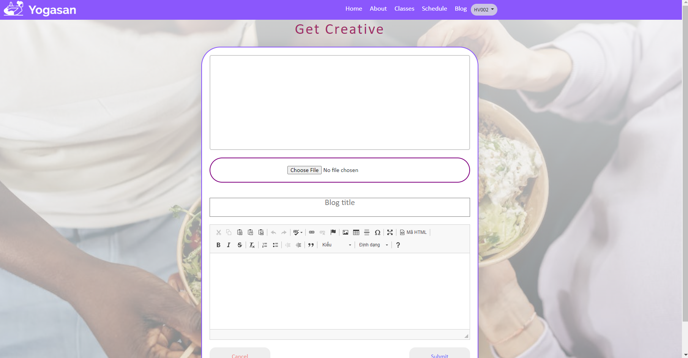

# YogaCenter
:wave: Welcome to our Software Development Project (SWP391) :wave:

## Table of Contents

- [Description](#description)
- [Preview Screenshot](#preview-screenshot)
- [Technology](#technology)
- [Functional requirements](#functional-requirements)
- [Useful Resources](#useful-resources)
- [Contributors](#contributors)
- [References](#references)
- [License & Copyright](#license--copyright)

## Description
- This is a website to register yoga classes obline
- This web works well on desktop, not for mobile.
- This project started from 22-05-2023 to 23-07-2023

## Preview Screenshot
  

  </img> &nbsp;&nbsp; </img>
  </img> &nbsp;&nbsp; </img>
  </img> &nbsp;&nbsp; </img>

## Technology
**1. Frontend**
  - HTML, CSS, JavaScript
  - Bootstrap 4

**2. Backend**
  - Java Language

**3. Database**
  - Microsoft SQL Server - a relational model database server produced by Microsoft
  - Full-Text Search - SQL Server

**4. Other Technologies**
- RESTful API
- MVC2 Model

**5. Tool**
  - Netbeans 17
  - Java JDK 17
  - Apache Tomcat 8.5.29
  - Visual Studio Code
  - Microsoft SQL Server Management Studio 18

## Functional requirements
**1. Trainee:**
- [x] Login 
- [x] View class
- [x] Register class
- [x] View blog
- [x] Sort blogs by categories
- [x] Create a blog
- [x] Comment in other blogs

**2. Trainer**
- [x] Login 
- [x] View assigned class 
- [x] View blog
- [x] Sort blogs by categories
- [x] Create a blog
- [x] Comment in other blogs

**3. Admin:**
- [x] Assign class for trainers
- [x] Approve blog created trainer/trainee
- [x] Create class, class types
- [x] Managing trainers/trainees
- [x] Account Management

## Contributors
**1. Mentors:**
- Lecturer - Main Mentor: [Nguyen Thi Cam Huong]

**2. Members:**
- [Tran Huu Dang](https://github.com/ibarakoi) - 	SE173303 - **Leader | Database Designer | Back-end Developer**
- [Nguyen Huy Long](https://github.com/Oalskad) - 	SE173280 - **Database Designer | Back-end Developer**
- [Nguyen Chi Thanh](https://github.com/Jacces) - 	SE173343 - **Front-end Developer | Back-end Developer**
- [Nguyen Dinh Trung Kien](https://github.com/devlindinh-2003) - SE173261 - **Front-end Developer | Back-end Developer**

