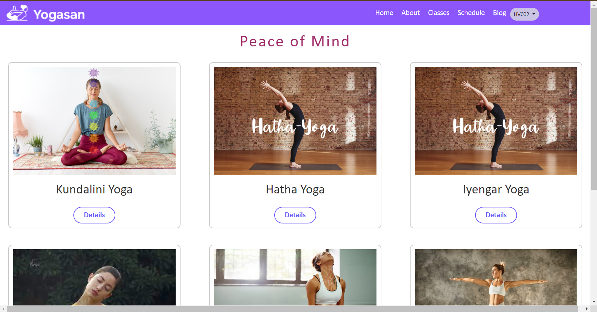
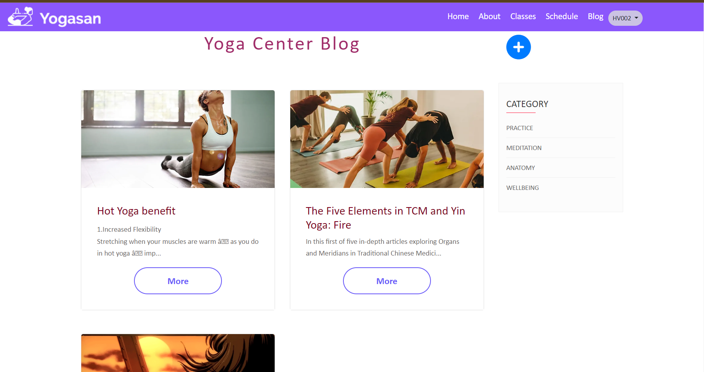

# YogaCenter
:wave: Welcome to our Software Development Project (SWP391) :wave:

## Table of Contents

- [Description](#description)
- [Preview Screenshot](#preview-screenshot)
- [Technology](#technology)
- [Functional requirements](#functional-requirements)
- [Useful Resources](#useful-resources)
- [Contributors](#contributors)
- [References](#references)
- [License & Copyright](#license--copyright)

## Description
- This is a website to register yoga classes obline
- This web works well on desktop, not for mobile.
- This project started from 22-05-2023 to 23-07-2023

## Preview Screenshot
  

  </img> &nbsp;&nbsp; </img>
  </img> &nbsp;&nbsp; </img>
  </img> &nbsp;&nbsp; </img>

  
